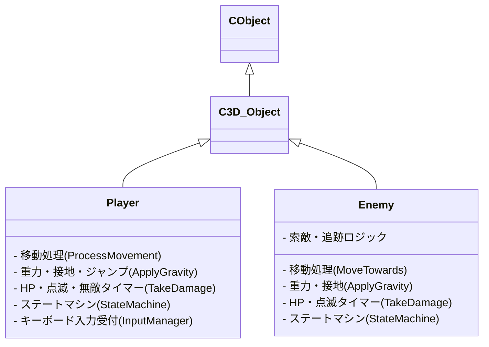
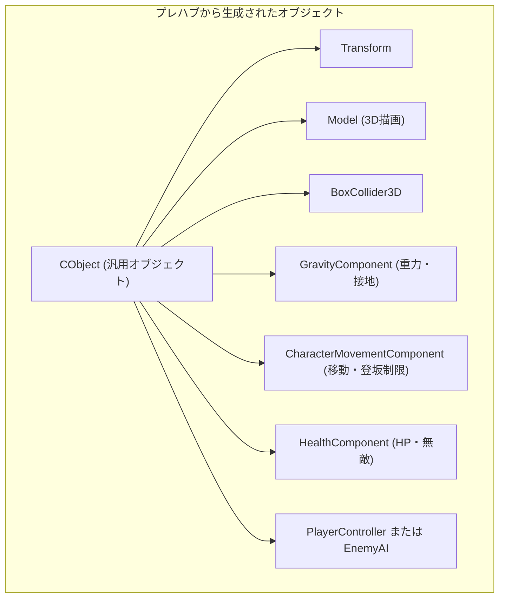
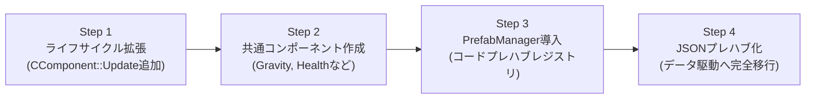

# コンポーネント指向移行 & プレハブシステム構築 提案書

現在クラス（`Player` や `Enemy` など）に直接実装されている処理を再利用可能な「コンポーネント」に分解し、Unityライクな「プレハブ（Prefab）システム」へと進化させるための設計および移行計画書です。

> [!NOTE]
> 本書はご要望に基づき**提案書のみの作成**です。コードの改修や実行は行わず、設計・方針のご確認を目的としています。

---

## 1. 現状のコード構造の分析と課題

現在のプロジェクトは、`CObject` がコンポーネント一覧（`Vector<UniquePtr<CComponent>> components`）を保持しており、既にコンポーネント指向の基礎があります。
しかし、実際のゲームロジックは依然として「クラス継承（OOP）」に強く依存しています。

### 現在の主な課題



1. **クラスへの処理の集中（モノリシック化）**:
   - `Player` や `Enemy` のクラス内に、「重力」「地形接地」「移動入力」「HP管理」「ステートマシン」など多岐にわたる責務が同居しています。
2. **コードの重複**:
   - 重力計算や接地スナップ、登坂制限、被ダメージ時の点滅処理などが `Player` と `Enemy` で二重に実装されています。
3. **クラスのコンストラクタが「プレハブ」の役割を兼任**:
   - `Player::Player()` や `Enemy::Enemy()` の中で「どのモデルを使うか」「どのコライダーサイズにするか」がハードコードされており、別の敵バリエーション（例: 足の速い敵、飛ぶ敵など）を作ろうとするとクラスを新設するか引数分岐を増やす必要があります。
4. **`CComponent` にライフサイクル関数がない**:
   - 現在の `CComponent` には `Init()` しかなく、`Update()` や `OnCollision()` がありません。そのため、独自の動きを持つコンポーネントを作っても、`CObject` から毎フレーム自動で動かすことができません。

---

## 2. 目指すゴール（アーキテクチャビジョン）

### 「合成（Composition）」によるオブジェクト構築



- **Player も Enemy も「同じ `CObject`」**:
  - `Player` という別個のクラスを作るのではなく、「移動＋重力＋HP＋キー入力」コンポーネントを載せればプレイヤーになります。
  - 「移動＋重力＋HP＋AI索敵」コンポーネントを載せれば敵になります。
- **再利用性と拡張性**:
  - 重力のパラメータを変えれば「低重力エリア」や「大ジャンプする敵」が一行で作れます。
  - 破壊可能な木箱や樽に `HealthComponent` を載せるだけで、プレイヤーと同じ攻撃判定・ダメージ処理が使えます。

---

## 3. 抽出するべきコンポーネントの設計

現在クラスに書かれているロジックを、以下の単一責任コンポーネントに分離します。

| コンポーネント名 | 責務・担当する処理 | 再利用先 |
| :--- | :--- | :--- |
| **`GravityComponent`** | ・重力加速度、終端速度<br>・足元のフィールド接地スナップ（坂道追従）<br>・ジャンプ初速の付与、接地フラグ管理 | プレイヤー、敵、落下するギミック、アイテム |
| **`CharacterMovementComponent`** | ・指定方向への水平移動（速度、加速・減速）<br>・急斜面の登坂制限（壁ずり処理）<br>・移動方向へのキャラクター自動旋回（Rotation） | プレイヤー、敵、NPC |
| **`HealthComponent`** | ・HP、最大HP、死亡フラグ<br>・ダメージ受付、無敵時間、被弾時メッシュ点滅<br>・死亡時コールバック（イベント通知） | プレイヤー、敵、破壊可能オブジェクト（樽・壁等） |
| **`PlayerControllerComponent`** | ・カメラ向きと WASD 入力から移動方向を決定<br>・SPACEキーでジャンプ指示<br>・攻撃キー（J / I）で弾発射や攻撃ステートへ遷移 | プレイヤー操作用 |
| **`EnemyAIComponent`** | ・索敵範囲内のプレイヤー検知<br>・追跡（Chasing）と攻撃（Attack）のステート制御 | 敵キャラクター用 |

---

## 4. プレハブ（Prefab）システムの設計

「どのコンポーネントを組み合わせるか」「パラメータをどう設定するか」を定義するプレハブシステムを導入します。

### アプローチ1: C++ コードベースのプレハブレジストリ（第1段階・推奨）
コード上でプレハブレシピを登録し、名前（"Player", "SlimeEnemy", "Boss" など）で簡単に呼び出せるようにします。

```cpp
// PrefabManager による生成イメージ
CObject* player = PrefabManager::GetInstance().Instantiate("Player");
CObject* enemy  = PrefabManager::GetInstance().Instantiate("MonkEnemy");
```

**プレハブ定義（レシピ）の例**:
```cpp
void RegisterPrefabs()
{
    // プレイヤープレハブ
    PrefabManager::GetInstance().RegisterPrefab("Player", [](CObject* obj) {
        obj->AddComponent<CTransform>()->SetScale({ 0.5f, 0.5f, 0.5f });
        
        auto model = obj->AddComponent<CModel>();
        model->CopyFrom(ModelManager::GetInstance().GetModel("Assets/Model/Wizard.glb"));
        
        auto col = obj->AddComponent<BoxCollider3D>();
        col->SetSize({ 0.6f, 1.5f, 0.6f });
        col->SetOffset({ 0.0f, 0.75f, 0.0f });

        obj->AddComponent<GravityComponent>(-25.0f, 8.5f); // 重力, ジャンプ力
        obj->AddComponent<CharacterMovementComponent>(0.1f); // 移動速度
        obj->AddComponent<HealthComponent>(10);              // HP 10
        obj->AddComponent<PlayerControllerComponent>();
    });
}
```

### アプローチ2: JSON データ駆動プレハブ（第2段階・将来的な拡張）
現在の `SceneSerializer` の JSON 構造を発展させ、ファイルからプレハブをロードできるようにします。
```json
{
  "prefabName": "WizardPlayer",
  "components": {
    "Model": { "path": "Assets/Model/Wizard.glb", "scale": [0.5, 0.5, 0.5] },
    "BoxCollider3D": { "size": [0.6, 1.5, 0.6], "offset": [0, 0.75, 0] },
    "Gravity": { "gravity": -25.0, "jumpPower": 8.5 },
    "Movement": { "speed": 0.1 },
    "Health": { "maxHp": 10 }
  }
}
```

---

## 5. 段階的な移行ロードマップ（4ステップ）

ゲームが常に動作する状態を保ちながら、安全にリファクタリングを進めるための手順です。



### Step 1: `CComponent` と `CObject` のライフサイクル拡張
- `CComponent` に `Awake()`, `Start()`, `Update(float dt)`, `LateUpdate()`, `OnCollision(CObject* other)` の仮想関数を追加。
- `CObject` の各関数（`Update()` や `OnCollision()`）が、所持している全コンポーネントの該当関数を一括で呼び出すようにする。
- **この段階では既存の Player や Enemy は一切壊れず、そのまま動作します。**

### Step 2: 共通ロジックをコンポーネントとして新設
- まず最も効果が高い `GravityComponent` と `HealthComponent` を新規作成。
- `Player` や `Enemy` の中に書かれていた重力・HP処理をこのコンポーネントに委譲（自身のコードから削除）。
- 重複コードが一掃され、バグ修正や調整が一箇所で済むようになります。

### Step 3: 移動・操作コンポーネントの分離と PrefabManager の導入
- `CharacterMovementComponent`, `PlayerControllerComponent`, `EnemyAIComponent` を作成。
- `PrefabManager` を作成し、`PrefabManager::Instantiate("Player")` / `Instantiate("Enemy")` でオブジェクトを生成できるようにする。
- `ObjectManager::Instantiate` と連携させる。

### Step 4: JSON プレハブへの拡張（オプション）
- JSON からプレハブのロード・インスタンス化を可能にし、エディタやテキスト編集だけで新しい敵やキャラを作成できるようにする。

---

## 6. Before / After のコード比較

### 【Before】現在の Player クラス（肥大化した状態）
```cpp
// クラス内にすべての機能が直接書かれており、200行を超える
class Player : public C3D_Object {
    float Speed, HP, m_verticalVelocity;
    bool m_isGrounded;
    StateMachine<Player> m_stateMachine;
    void ProcessMovement(float dt);
    void ApplyGravity(float dt);
    void TakeDamage(int dmg);
    void Update() override {
        // 重力、点滅、アニメーション、ステートマシン、キー入力がすべて混在
        ApplyGravity(dt);
        ProcessMovement(dt);
        m_stateMachine.OnUpdate(dt);
        ...
    }
};
```

### 【After】コンポーネント指向 & プレハブ化後
```cpp
// オブジェクト自体は極めて軽量。コンポーネントの組み合わせだけで振る舞いが決まる
CObject* player = PrefabManager::GetInstance().Instantiate("Player");

// CObject::Update() が内部で以下を自動実行：
// 1. PlayerController::Update (入力検知)
// 2. CharacterMovement::Update (移動と登坂)
// 3. GravityComponent::Update (重力と接地)
// 4. Model::Update (アニメーション)
// 5. HealthComponent::Update (点滅タイマー)
```

---

## 7. ご確認・ご相談事項

> [!IMPORTANT]
> 1. **移行の優先順位について**:
>    - まずは **「Step 1（コンポーネントのUpdate対応）」** と **「Step 2（重力 GravityComponent / HP HealthComponent の切り出し）」** から始めるのが最も安全でおすすめですが、この順番で進めてよろしいでしょうか？
> 2. **プレハブの形式について**:
>    - 最初は C++ コードで組み立てる **「C++ プレハブレジストリ」** から始めるのがシンプルで開発効率が良いですが、最初から **「JSON ファイルによるプレハブ」** を目指したいご希望はありますか？
