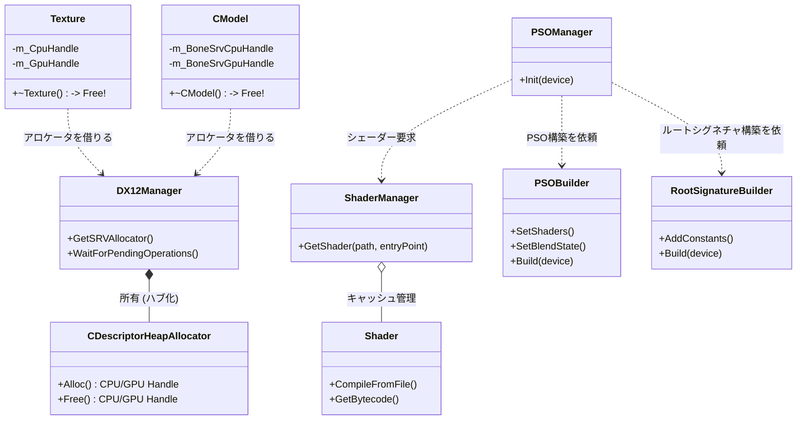

# リファクタリング作業まとめ（Phase 3）

今回の作業（【Step 1】〜【Step 3】および一部の【Step 4】）により、DirectX12の複雑だったリソース管理とパイプライン構築が劇的にクリーンになりました。
新しくなったアーキテクチャの概念図と、各クラスの役割をまとめました。

## 1. 全体像の概念図（クラス同士の関係性）

---

## 2. 各クラスの役割と「今回どう変わったか」

### 🎯 リソース管理のハブ（【Step 3】【Step 4】）

#### `DX12Manager`
*   **役割:** DirectX 12の初期化や、描画に関連するコマンドリスト、デバイスなどの大元を管理する「ハブ（拠点）」。
*   **今回の進化:** 内部に `CDescriptorHeapAllocator` を内包しました。これにより、各クラスが勝手にインデックス番号をやり取りする時代が終わり、すべて `DX12Manager` を経由して安全にディスクリプタを借りる形になりました。

#### `CDescriptorHeapAllocator`
*   **役割:** SRV（シェーダーリソースビュー）などのディスクリプタの空き状況を管理し、「使いたい」と言われたら貸し出し（`Alloc`）、「もう使わない」と言われたら回収（`Free`）する管理者。

#### `Texture` / `CModel`
*   **役割:** 実際の画像データや3Dモデルデータを保持し、GPUに送るリソース。
*   **今回の進化:** 誰かから「あなたはN番目ね」と言われる（インデックス手動管理）のをやめました。作られる時に自分自身でアロケータからディスクリプタを確保し、**自分が破棄される（デストラクタが呼ばれる）時に自動でアロケータに返却**するようになりました。これによりメモリリークや不正アクセスの危険が激減しました。

### 🎨 シェーダーとパイプラインの構築（【Step 1】【Step 2】）

#### `ShaderManager` （★今回新設）
*   **役割:** プログラム中で使われるすべてのシェーダー（`.hlsl` や `.cso`）を一元管理するキャッシュ庫。
*   **今回の進化:** 同じシェーダーを何度もコンパイルしないように、「ファイル名＋エントリポイント（例: `Triangle.hlsl:VSMain`）」をキーにして管理します。誰かが欲しがったらキャッシュから素早く渡します。

#### `Shader` （★今回新設）
*   **役割:** 1つのシェーダーのコンパイル結果（バイトコード `ID3DBlob`）をカプセル化して保持するクラス。

#### `RootSignatureBuilder` / `PSOBuilder` （★今回新設）
*   **役割:** 複雑怪奇な DirectX12 のパイプライン設定（ブレンドモードやカリング、定数バッファの配置など）を、メソッドチェーン（`.SetHoge().SetFuga()` のような書き方）で直感的に組み立ててくれる「建築家」。

#### `PSOManager`
*   **役割:** ゲーム中で使用する「パイプラインステート（グラフィックスの設定状態）」を保持し、切り替えられるようにするマネージャー。
*   **今回の進化:** 以前は `Init()` の中に数百行にわたって「シェーダーのコンパイル」や「DirectXへの複雑な設定のお作法」がベタ書きされていました。今回、それをすべて **「ShaderManager にシェーダーをもらい、PSOBuilder に設計図を渡して作ってもらう」** という美しい処理に置き換わりました。コード量が激減し、何をしているかが一目でわかるようになりました。
